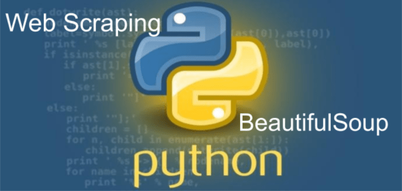

# Guess the Author


## Introduction
This project was created while learning from Colt Steele's - [The Modern Python 3 Bootcamp Course](https://www.udemy.com/course/the-modern-python3-bootcamp/).

The intention behind this project was to ensure that the students of this program properly learned how to create an automated web crawler and scraper, while also implementing fundamentals from earlier on in the course.

This game will scrape the quotes from the [Quotes to Scrape](http://quotes.toscrape.com/) website and give the player 4 tries to guess who the author of the famous quote provided is. Whether the player wins or loses, they have a chance at the end of each round to continue playing or not.

## Installation
To use this project, start by cloning the repository on your local machine. Once you've cloned it, create a virtual environment on your preferred CLI. Since I use Windows, the command I used to create my virtual environment is:
```ssh
py -m venv <virtualenvironment>
```
Once you've created your virtual environment, install the required library packages using:
```ssh
pip install -r requirements.txt
```
After you have the libraries installed, you can run the Python script and enjoy the game! &#128513;

## Contributions
If you would like to contribute to this project, please clone the repository and create a separate branch:
```ssh
git clone git@github.com:kristinalagasca/GuessTheAuthor.git
git checkout -b <branchname>
```

For the branch naming convention, please format it with your name and branch name. i.e:
```ssh
lagascatorres-tina_feature-update
```
Once you've added your code to your branch, please submit a pull request [here](https://github.com/kristinalagasca/GuessTheAuthor/pulls) and assign [me](https://github.com/kristinalagasca) as the reviewer. Thank you!